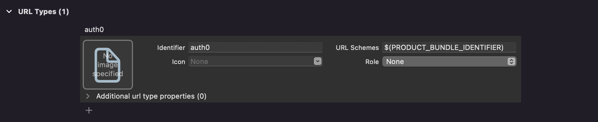

# Auth0.swift

[](https://circleci.com/gh/auth0/Auth0.swift/tree/master)

[](https://codecov.io/github/auth0/Auth0.swift)


Easily integrate Auth0 into iOS, macOS, tvOS, and watchOS apps. Add **login** and **logout**, store **credentials** securely, and access **user information**.

**Migrating from v1? Check the [Migration Guide](V2_MIGRATION_GUIDE.md).**

---

## Table of Contents

- [**Documentation**](#documentation)
- [**Requirements**](#requirements)
- [**Installation**](#installation)
  + [Swift Package Manager](#swift-package-manager)
  + [Cocoapods](#cocoapods)
  + [Carthage](#carthage)
- [**Getting Started**](#getting-started)
  + [Configuration](#configuration)
  + [Web Auth Configuration (iOS / macOS)](#web-auth-configuration-ios--macos)
  + [Web Auth Login (iOS / macOS)](#web-auth-login-ios--macos)
  + [Web Auth Logout (iOS / macOS)](#web-auth-logout-ios--macos)
  + [SSO Alert Box (iOS / macOS)](#sso-alert-box-ios--macos)
- [**Next Steps**](#next-steps)
  + [Common Tasks](#common-tasks)
  + [Web Auth (iOS / macOS)](#web-auth-ios--macos)
  + [Credentials Manager (iOS / macOS / tvOS / watchOS)](#credentials-manager-ios--macos--tvos--watchos)
  + [Authentication API (iOS / macOS / tvOS / watchOS)](#authentication-api-ios--macos--tvos--watchos)
  + [Management API (Users) (iOS / macOS / tvOS / watchOS)](#management-api-users-ios--macos--tvos--watchos)
  + [Logging](#logging)
- [**Advanced Features**](#advanced-features)
  + [Native Social Login](#native-social-login)
  + [Organizations](#organizations)
  + [Bot Detection](#bot-detection)
- [**Support Policy**](#support-policy)
- [**Issue Reporting**](#issue-reporting)
- [**What is Auth0?**](#what-is-auth0)
- [**License**](#license)

## Documentation

- [**Quickstart**](https://auth0.com/docs/quickstart/native/ios-swift)
  <br>Shows how to integrate Auth0.swift into an iOS / macOS app from scratch.
- [**Sample app**](https://github.com/auth0-samples/auth0-ios-swift-sample/tree/master/Sample-01)
  <br>A complete, running iOS / macOS app you can try.
- [**API documentation**](https://auth0.github.io/Auth0.swift/)
  <br>Documentation auto-generated from the code comments that explains all the available features.
  + [Web Auth](https://auth0.github.io/Auth0.swift/Protocols/WebAuth.html)
  + [Credentials Manager](https://auth0.github.io/Auth0.swift/Structs/CredentialsManager.html)
  + [Authentication API Client](https://auth0.github.io/Auth0.swift/Protocols/Authentication.html)
  + [Management API Client (Users)](https://auth0.github.io/Auth0.swift/Protocols/Users.html)
- [**FAQ**](FAQ.md)
  <br> Answers some common questions about Auth0.swift.

## Requirements

- iOS 12+ / macOS 10.15+ / tvOS 12.0+ / watchOS 6.2+
- Xcode 12.x / 13.x
- Swift 5.3+

> ⚠️ Check the [Support Policy](#support-policy) to learn when dropping Xcode, Swift, and platform versions will not be considered a **breaking change**.

## Installation

### Swift Package Manager

Open the following menu item in Xcode:

**File > Add Packages...**

In the **Search or Enter Package URL** search box enter this URL: 

```text
https://github.com/auth0/Auth0.swift
```

Then, select the dependency rule and press **Add Package**.

> 💡 For further reference on SPM, check its [official documentation](https://developer.apple.com/documentation/swift_packages/adding_package_dependencies_to_your_app).

### Cocoapods

Add the following line to your `Podfile`:

```ruby
pod 'Auth0', '~> 2.2'
```

Then, run `pod install`.

> 💡 For further reference on Cocoapods, check their [official documentation](https://guides.cocoapods.org/using/getting-started.html).

### Carthage

Add the following line to your `Cartfile`:

```text
github "auth0/Auth0.swift" ~> 2.2
```

Then, run `carthage bootstrap --use-xcframeworks`.

> 💡 For further reference on Carthage, check their [official documentation](https://github.com/Carthage/Carthage#getting-started).

## Getting Started

### Configuration

Auth0.swift needs the **Client ID** and **Domain** of the Auth0 application to communicate with Auth0. You can find these details in the settings page of your [Auth0 application](https://manage.auth0.com/#/applications/). If you are using a [custom domain](https://auth0.com/docs/brand-and-customize/custom-domains), use the value of your custom domain instead of the value from the settings page.

> ⚠️ Make sure that the [application type](https://auth0.com/docs/configure/applications) of the Auth0 application is **Native**. If you don’t have a Native Auth0 application already, [create one](https://auth0.com/docs/get-started/create-apps/native-apps) before continuing.

#### Configure Client ID and Domain with a plist

Create a `plist` file named `Auth0.plist` in your app bundle with the following content:

```xml
<?xml version="1.0" encoding="UTF-8"?>
<!DOCTYPE plist PUBLIC "-//Apple//DTD PLIST 1.0//EN" "http://www.apple.com/DTDs/PropertyList-1.0.dtd">
<plist version="1.0">
<dict>
    <key>ClientId</key>
    <string>YOUR_AUTH0_CLIENT_ID</string>
    <key>Domain</key>
    <string>YOUR_AUTH0_DOMAIN</string>
</dict>
</plist>
```

#### Configure Client ID and Domain programmatically

<details>
  <summary>For Web Auth</summary>

```swift
Auth0
    .webAuth(clientId: "YOUR_AUTH0_CLIENT_ID", domain: "YOUR_AUTH0_DOMAIN")
    // ...
```
</details>

<details>
  <summary>For the Authentication API client</summary>

```swift
Auth0
    .authentication(clientId: "YOUR_AUTH0_CLIENT_ID", domain: "YOUR_AUTH0_DOMAIN")
    // ...
```
</details>

<details>
  <summary>For the Management API client (Users)</summary>

```swift
Auth0
    .users(token: credentials.accessToken, domain: "YOUR_AUTH0_DOMAIN") // You only need the Domain
    // ...
```
</details>

### Web Auth Configuration (iOS / macOS)

#### Configure callback and logout URLs

The callback and logout URLs are the URLs that Auth0 invokes to redirect back to your app. Auth0 invokes the callback URL after authenticating the user, and the logout URL after removing the session cookie.

Since callback and logout URLs can be manipulated, you will need to add your URLs to the **Allowed Callback URLs** and **Allowed Logout URLs** fields in the settings page of your Auth0 application. This will enable Auth0 to recognize these URLs as valid. If the callback and logout URLs are not set, users will be unable to log in and out of the app and will get an error.

Go to the settings page of your [Auth0 application](https://manage.auth0.com/#/applications/) and add the corresponding URL to **Allowed Callback URLs** and **Allowed Logout URLs**, according to the platform of your app. If you are using a [custom domain](https://auth0.com/docs/brand-and-customize/custom-domains), replace `YOUR_AUTH0_DOMAIN` with the value of your custom domain instead of the value from the settings page.

##### iOS

```text
YOUR_BUNDLE_IDENTIFIER://YOUR_AUTH0_DOMAIN/ios/YOUR_BUNDLE_IDENTIFIER/callback
```

##### macOS

```text
YOUR_BUNDLE_IDENTIFIER://YOUR_AUTH0_DOMAIN/macos/YOUR_BUNDLE_IDENTIFIER/callback
```

For example, if your iOS bundle identifier was `com.company.myapp` and your Auth0 Domain was `company.us.auth0.com`, then this value would be:

```text
com.company.myapp://company.us.auth0.com/ios/com.company.myapp/callback
```

#### Configure custom URL scheme

Back in Xcode, go to the **Info** tab of your app target settings. In the **URL Types** section, click the **＋** button to add a new entry. There, enter `auth0` into the **Identifier** field and `$(PRODUCT_BUNDLE_IDENTIFIER)` into the **URL Schemes** field.



This registers your bundle identifier as a custom URL scheme, so the callback and logout URLs can reach your app.

### Web Auth Login (iOS / macOS)

Import the `Auth0` module in the file where you want to present the login page.

```swift
import Auth0
```

Then, present the [Universal Login](https://auth0.com/docs/authenticate/login/auth0-universal-login) page in the action of your **Login** button.

```swift
Auth0
    .webAuth()
    .start { result in
        switch result {
        case .success(let credentials):
            print("Obtained credentials: \(credentials)")
        case .failure(let error):
            print("Failed with: \(error)")
        }
    }
```

<details>
  <summary>Using async/await</summary>

```swift
do {
    let credentials = try await Auth0
        .webAuth()
        .start()
    print("Obtained credentials: \(credentials)")
} catch {
    print("Failed with: \(error)")
}
```
</details>

<details>
  <summary>Using Combine</summary>

```swift
Auth0
    .webAuth()
    .start()
    .sink(receiveCompletion: { completion in
        if case .failure(let error) = completion {
            print("Failed with: \(error)")
        }
    }, receiveValue: { credentials in
        print("Obtained credentials: \(credentials)")
    })
    .store(in: &cancellables)
```
</details>

### Web Auth Logout (iOS / macOS)

Logging the user out involves clearing the Universal Login session cookie and then deleting the user's credentials from your app.

Call the `clearSession()` method in the action of your **Logout** button. Once the session cookie has been cleared, [delete the user's credentials](#clear-stored-credentials).

```swift
Auth0
    .webAuth()
    .clearSession { result in
        switch result {
        case .success:
            print("Session cookie cleared")
            // Delete credentials
        case .failure(let error):
            print("Failed with: \(error)")
        }
    }
```

<details>
  <summary>Using async/await</summary>

```swift
do {
    try await Auth0
        .webAuth()
        .clearSession()
    print("Session cookie cleared")
    // Delete credentials
} catch {
    print("Failed with: \(error)")
}
```
</details>

<details>
  <summary>Using Combine</summary>

```swift
Auth0
    .webAuth()
    .clearSession()
    .sink(receiveCompletion: { completion in
        switch completion {
        case .finished:
            print("Session cookie cleared")
            // Delete credentials
        case .failure(let error):
            print("Failed with: \(error)")
        }
    }, receiveValue: {})
    .store(in: &cancellables)
```
</details>

### SSO Alert Box (iOS / macOS)


Check the [FAQ](FAQ.md) for more information about the alert box that pops up **by default** when using Web Auth.

> 💡 See also [this blog post](https://developer.okta.com/blog/2022/01/13/mobile-sso) for a detailed overview of single sign-on (SSO) on iOS.

[Go up ⤴](#table-of-contents)

## Next Steps

### Common Tasks

- [**Retrieve user information**](#retrieve-user-information)
  <br>Fetch the latest user information from the `/userinfo` endpoint.
- [**Store credentials**](#store-credentials)
  <br>Store the user's credentials securely in the Keychain.
- [**Retrieve stored credentials**](#retrieve-stored-credentials)
  <br>Fetch the user's credentials from the Keychain, automatically renewing them if they have expired.
- [**Clear stored credentials**](#clear-stored-credentials)
  <br>Delete the user's credentials to complete the logout process.
- [**Enable debug logging**](#logging)
  <br>Print HTTP requests and responses for debugging.

### Web Auth (iOS / macOS)

**See all the available features in the [API documentation ↗](https://auth0.github.io/Auth0.swift/Protocols/WebAuth.html)**

- [Web Auth signup](#web-auth-signup)
- [Web Auth configuration](#web-auth-configuration)
- [ID token validation](#id-token-validation)
- [Web Auth errors](#web-auth-errors)

#### Web Auth signup

You can make users land directly on the Signup page instead of the Login page by specifying the `"screen_hint": "signup"` parameter. Note that this can be combined with `"prompt": "login"`, which indicates whether you want to always show the authentication page or you want to skip if there's an existing session.

| Parameters                                     | No existing session   | Existing session              |
|:-----------------------------------------------|:----------------------|:------------------------------|
| No extra parameters                            | Shows the login page  | Redirects to the callback url |
| `"screen_hint": "signup"`                      | Shows the signup page | Redirects to the callback url |
| `"prompt": "login"`                            | Shows the login page  | Shows the login page          |
| `"prompt": "login", "screen_hint": "signup"`   | Shows the signup page | Shows the signup page         |

```swift
Auth0
    .webAuth()
    .parameters(["screen_hint": "signup"])
    .start { result in
        switch result {
        case .success(let credentials):
            print("Obtained credentials: \(credentials)")
        case .failure(let error):
            print("Failed with: \(error)")
        }
    }
```

> ⚠️ The `screen_hint` parameter will work with the **New Universal Login Experience** without any further configuration. If you are using the **Classic Universal Login Experience**, you need to customize the [login template](https://manage.auth0.com/#/login_page) to look for this parameter and set the `initialScreen` [option](https://github.com/auth0/lock#database-options) of the `Auth0Lock` constructor.

<details>
  <summary>Using async/await</summary>

```swift
do {
    let credentials = try await Auth0
        .webAuth()
        .parameters(["screen_hint": "signup"])
        .start()
    print("Obtained credentials: \(credentials)")
} catch {
    print("Failed with: \(error)")
}
```
</details>

<details>
  <summary>Using Combine</summary>

```swift
Auth0
    .webAuth()
    .parameters(["screen_hint": "signup"])
    .start()
    .sink(receiveCompletion: { completion in
        if case .failure(let error) = completion {
            print("Failed with: \(error)")
        }
    }, receiveValue: { credentials in
        print("Obtained credentials: \(credentials)")
    })
    .store(in: &cancellables)
```
</details>

#### Web Auth configuration

The following are some of the available Web Auth configuration options. Check the [API documentation](https://auth0.github.io/Auth0.swift/Protocols/WebAuth.html) for the full list.

##### Use any Auth0 connection

Specify an Auth0 connection to directly show that identity provider's login page, skipping the [Universal Login](https://auth0.com/docs/authenticate/login/auth0-universal-login) page itself. The connection must first be enabled for your Auth0 application in the [Dashboard](https://manage.auth0.com/#/applications/).

```swift
Auth0
    .webAuth()
    .connection("facebook") // Show the Facebook login page
    // ...
```

##### Add an audience value

Specify an [audience](https://auth0.com/docs/secure/tokens/access-tokens/get-access-tokens#control-access-token-audience) to obtain an access token that can be used to make authenticated requests to a backend. The audience value is the **API Identifier** of your [Auth0 API](https://auth0.com/docs/get-started/apis), for example `https://example.com/api`.

```swift
Auth0
    .webAuth()
    .audience("YOUR_AUTH0_API_IDENTIFIER")
    // ...
```

##### Add a scope value

Specify a [scope](https://auth0.com/docs/get-started/apis/scopes) to request permission to access protected resources, like the user profile. The default scope value is `openid profile email`. Regardless of the scope value specified, `openid` is always included.

```swift
Auth0
    .webAuth()
    .scope("openid profile email offline_access read:todos")
    // ...
```

Use `connectionScope()` to configure a scope value for an Auth0 connection.

```swift
Auth0
    .webAuth()
    .connection("connection-name")
    .connectionScope("user_friends email")
    // ...
```

##### Use a custom `URLSession` instance

You can specify a custom `URLSession` instance for more advanced networking configuration, such as customizing timeout values.

```swift
Auth0
    .webAuth(session: customURLSession)
    // ...
```

Note that this custom `URLSession` instance will be used when communicating with the Auth0 Authentication API, not when opening the [Universal Login](https://auth0.com/docs/authenticate/login/auth0-universal-login) page.

#### ID token validation

Auth0.swift automatically [validates](https://auth0.com/docs/security/tokens/id-tokens/validate-id-tokens) the ID token obtained from Web Auth login, following the [OpenID Connect specification](https://openid.net/specs/openid-connect-core-1_0.html). This ensures the contents of the ID token have not been tampered with and can be safely used.

##### Custom Domains

Users of Auth0 Private Cloud with custom domains still on the [legacy behavior](https://auth0.com/docs/deploy/private-cloud/private-cloud-migrations/migrate-private-cloud-custom-domains) need to specify a custom issuer to match the Auth0 Domain when performing Web Auth login. Otherwise, the ID token validation will fail.

```swift
Auth0
    .webAuth()
    .issuer("https://YOUR_AUTH0_DOMAIN/")
    // ...
```

#### Web Auth errors

Web Auth will only produce `WebAuthError` error values. You can find the underlying error (if any) in the `cause: Error?` property of the `WebAuthError`. Not all error cases will have an underlying `cause`. Check the [API documentation](https://auth0.github.io/Auth0.swift/Structs/WebAuthError.html) to learn more about the error cases you need to handle, and which ones include a `cause` value.

> ⚠️ Do not parse or otherwise rely on the error messages to handle the errors. The error messages are not part of the API and can change. Run a switch statement on the [error cases](https://auth0.github.io/Auth0.swift/Structs/WebAuthError.html#/Error%20Cases) instead, which are part of the API.

### Credentials Manager (iOS / macOS / tvOS / watchOS)

**See all the available features in the [API documentation ↗](https://auth0.github.io/Auth0.swift/Structs/CredentialsManager.html)**

- [Store credentials](#store-credentials)
- [Check for stored credentials](#check-for-stored-credentials)
- [Retrieve stored credentials](#retrieve-stored-credentials)
- [Retrieve stored user information](#retrieve-stored-user-information)
- [Clear stored credentials](#clear-stored-credentials)
- [Biometric authentication](#biometric-authentication)
- [Credentials Manager errors](#credentials-manager-errors)

The Credentials Manager utility allows you to securely store and retrieve the user's credentials from the Keychain.

```swift
let credentialsManager = CredentialsManager(authentication: Auth0.authentication())
```

#### Store credentials

When your users log in, store their credentials securely in the Keychain. You can then check if their credentials are still valid when they open your app again.

```swift
let didStore = credentialsManager.store(credentials: credentials)
```

#### Check for stored credentials

When the users open your app, check for stored credentials. If they exist, you can retrieve them and redirect the users to the app's main flow without any additional login steps.

##### If you are using refresh tokens

```swift
guard credentialsManager.canRenew() else {
    // No renewable credentials exist, present the login page
}
// Retrieve the stored credentials
```

> 💡 You need to request the `offline_access` [scope](https://auth0.com/docs/get-started/apis/scopes) when logging in to get a refresh token from Auth0.

##### If you are not using refresh tokens

```swift
guard credentialsManager.hasValid() else {
    // No valid credentials exist, present the login page
}
// Retrieve the stored credentials
```

#### Retrieve stored credentials 

The credentials will be automatically renewed (if expired) using the [refresh token](https://auth0.com/docs/secure/tokens/refresh-tokens). **This method is thread-safe.**

```swift
credentialsManager.credentials { result in 
    switch result {
    case .success(let credentials):
        print("Obtained credentials: \(credentials)")
    case .failure(let error):
        print("Failed with: \(error)") 
    }
}
```

> 💡 You do not need to call `store(credentials:)` afterward. The Credentials Manager automatically persists the renewed credentials.

<details>
  <summary>Using async/await</summary>

```swift
do {
    let credentials = try await credentialsManager.credentials()
    print("Obtained credentials: \(credentials)")
} catch {
    print("Failed with: \(error)")
}
```
</details>

<details>
  <summary>Using Combine</summary>

```swift
credentialsManager
    .credentials()
    .sink(receiveCompletion: { completion in
        if case .failure(let error) = completion {
            print("Failed with: \(error)")
        }
    }, receiveValue: { credentials in
        print("Obtained credentials: \(credentials)")
    })
    .store(in: &cancellables)
```
</details>

> 💡 You need to request the `offline_access` [scope](https://auth0.com/docs/get-started/apis/scopes) when logging in to get a refresh token from Auth0.

#### Retrieve stored user information

The stored [ID token](https://auth0.com/docs/security/tokens/id-tokens) contains a copy of the user information at the time of authentication (or renewal, if the credentials were renewed). That user information can be retrieved from the Keychain synchronously, without checking if the credentials expired.

```swift
let user = credentialsManager.user
```

> 💡 To get the latest user information, use the `userInfo(withAccessToken:)` method of the Authentication API client.

#### Clear stored credentials

The stored credentials can be removed from the Keychain by using the `clear()` method.

```swift
let didClear = credentialsManager.clear()
```

#### Biometric authentication

You can enable an additional level of user authentication before retrieving credentials using the biometric authentication supported by the device, for example Face ID or Touch ID.

```swift
credentialsManager.enableBiometrics(withTitle: "Touch to Login")
```

If needed, you can specify a particular `LAPolicy` to be used. For example, you might want to support Face ID or Touch ID, but also allow fallback to passcode.

```swift
credentialsManager.enableBiometrics(withTitle: "Touch or enter passcode to Login", 
                                    evaluationPolicy: .deviceOwnerAuthentication)
```

> ⚠️ Retrieving the user information with `credentialsManager.user` will not be protected by biometric authentication.

#### Credentials Manager errors

The Credentials Manager will only produce `CredentialsManagerError` error values. You can find the underlying error (if any) in the `cause: Error?` property of the `CredentialsManagerError`. Not all error cases will have an underlying `cause`. Check the [API documentation](https://auth0.github.io/Auth0.swift/Structs/CredentialsManagerError.html) to learn more about the error cases you need to handle, and which ones include a `cause` value.

> ⚠️ Do not parse or otherwise rely on the error messages to handle the errors. The error messages are not part of the API and can change. Run a switch statement on the [error cases](https://auth0.github.io/Auth0.swift/Structs/CredentialsManagerError.html#/Error%20Cases) instead, which are part of the API.

### Authentication API (iOS / macOS / tvOS / watchOS)

**See all the available features in the [API documentation ↗](https://auth0.github.io/Auth0.swift/Protocols/Authentication.html)**

- [Login with database connection](#login-with-database-connection)
- [Sign up with database connection](#sign-up-with-database-connection)
- [Passwordless login](#passwordless-login)
- [Retrieve user information](#retrieve-user-information)
- [Renew credentials](#renew-credentials)
- [Authentication API client configuration](#authentication-api-client-configuration)
- [Authentication API client errors](#authentication-api-client-errors)

The Authentication API exposes the AuthN/AuthZ functionality of Auth0, as well as the supported identity protocols like OpenID Connect, OAuth 2.0, and SAML.
We recommend using [Universal Login](https://auth0.com/docs/authenticate/login/auth0-universal-login), but if you prefer to build your own UI you can use our API endpoints to do so. However, some Auth flows (grant types) are disabled by default so you must enable them in the settings page of your [Auth0 application](https://manage.auth0.com/#/applications/), as explained in [Update Grant Types](https://auth0.com/docs/get-started/applications/update-grant-types).

For login or signup with username/password, the `Password` grant type needs to be enabled in your Auth0 application. If you set the grants via the Management API you should activate both `http://auth0.com/oauth/grant-type/password-realm` and `Password`. Otherwise, the Auth0 Dashboard will take care of activating both when enabling `Password`.

> 💡 If your Auth0 account has the **Bot Detection** feature enabled, your requests might be flagged for verification. Check how to handle this scenario in the [Bot Detection](#bot-detection) section.

> ⚠️ The ID tokens obtained from Web Auth login are automatically validated by Auth0.swift, ensuring their contents have not been tampered with. **This is not the case for the ID tokens obtained from the Authentication API client.** You must [validate](https://auth0.com/docs/security/tokens/id-tokens/validate-id-tokens) any ID tokens received from the Authentication API client before using the information they contain.

#### Login with database connection

```swift
Auth0
    .authentication()
    .login(usernameOrEmail: "support@auth0.com",
           password: "secret-password",
           realmOrConnection: "Username-Password-Authentication",
           scope: "openid profile email offline_access")
    .start { result in
        switch result {
        case .success(let credentials):
            print("Obtained credentials: \(credentials)")
        case .failure(let error):
            print("Failed with: \(error)")
        }
    }
```

<details>
  <summary>Using async/await</summary>

```swift
do {
    let credentials = try await Auth0
        .authentication()
        .login(usernameOrEmail: "support@auth0.com",
               password: "secret-password",
               realmOrConnection: "Username-Password-Authentication",
               scope: "openid profile email offline_access")
        .start()
    print("Obtained credentials: \(credentials)")
} catch {
    print("Failed with: \(error)")
}
```
</details>

<details>
  <summary>Using Combine</summary>

```swift
Auth0
    .authentication()
    .login(usernameOrEmail: "support@auth0.com",
           password: "secret-password",
           realmOrConnection: "Username-Password-Authentication",
           scope: "openid profile email offline_access")
    .start()
    .sink(receiveCompletion: { completion in
        if case .failure(let error) = completion {
            print("Failed with: \(error)")
        }
    }, receiveValue: { credentials in
        print("Obtained credentials: \(credentials)")
    })
    .store(in: &cancellables)
```
</details>

> 💡 The default scope value is `openid profile email`. Regardless of the scope value specified, `openid` is always included.

#### Sign up with database connection

```swift
Auth0
    .authentication()
    .signup(email: "support@auth0.com",
            password: "secret-password",
            connection: "Username-Password-Authentication",
            userMetadata: ["first_name": "John", "last_name": "Appleseed"])
    .start { result in
        switch result {
        case .success(let user):
            print("User signed up: \(user)")
        case .failure(let error):
            print("Failed with: \(error)")
        }
    }
```

<details>
  <summary>Using async/await</summary>

```swift
do {
    let user = try await Auth0
        .authentication()
        .signup(email: "support@auth0.com",
                password: "secret-password",
                connection: "Username-Password-Authentication",
                userMetadata: ["first_name": "John", "last_name": "Appleseed"])
        .start()
    print("User signed up: \(user)")
} catch {
    print("Failed with: \(error)")
}
```
</details>

<details>
  <summary>Using Combine</summary>

```swift
Auth0
    .authentication()
    .signup(email: "support@auth0.com",
            password: "secret-password",
            connection: "Username-Password-Authentication",
            userMetadata: ["first_name": "John", "last_name": "Appleseed"])
    .start()
    .sink(receiveCompletion: { completion in
        if case .failure(let error) = completion {
            print("Failed with: \(error)")
        }
    }, receiveValue: { user in
        print("User signed up: \(user)")
    })
    .store(in: &cancellables)
```
</details>

> 💡 You might want to log the user in after signup. See [Login with database connection](#login-with-database-connection) above for an example.

#### Passwordless login

Passwordless is a two-step authentication flow that requires the **Passwordless OTP** grant to be enabled for your Auth0 application. Check [our documentation](https://auth0.com/docs/configure/applications/application-grant-types) for more information.

##### 1. Start the passwordless flow

Request a code to be sent to the user's email or phone number. For email scenarios, a link can be sent in place of the code.

```swift
Auth0
    .authentication(clientId: clientId, domain: "samples.auth0.com")
    .startPasswordless(email: "support@auth0.com")
    .start { result in
        switch result {
        case .success:
            print("Code sent")
        case .failure(let error):
            print("Failed with: \(error)")
        }
    }
```

<details>
  <summary>Using async/await</summary>

```swift
do {
    try await Auth0
        .authentication()
        .startPasswordless(email: "support@auth0.com")
        .start()
    print("Code sent")
} catch {
    print("Failed with: \(error)")
}
```
</details>

<details>
  <summary>Using Combine</summary>

```swift
Auth0
    .authentication()
    .startPasswordless(email: "support@auth0.com")
    .start()
    .sink(receiveCompletion: { completion in
        switch completion {
        case .finished:
            print("Code sent")
        case .failure(let error):
            print("Failed with: \(error)")
        }
    }, receiveValue: {})
    .store(in: &cancellables)
```
</details>

> 💡 Use `startPasswordless(phoneNumber:)` to send a code to the user's phone number instead.

##### 2. Login with the received code

To complete the authentication, you must send back that code the user received along with the email or phone number used to start the flow.

```swift
Auth0
    .authentication(clientId: clientId, domain: "samples.auth0.com")
    .login(email: "support@auth0.com", code: "123456")
    .start { result in
        switch result {
        case .success(let credentials):
            print("Obtained credentials: \(credentials)")
        case .failure(let error):
            print("Failed with: \(error)")
        }
    }
```

<details>
  <summary>Using async/await</summary>

```swift
do {
    let credentials = try await Auth0
        .authentication()
        .login(email: "support@auth0.com", code: "123456")
        .start()
    print("Obtained credentials: \(credentials)")
} catch {
    print("Failed with: \(error)")
}
```
</details>

<details>
  <summary>Using Combine</summary>

```swift
Auth0
    .authentication()
    .login(email: "support@auth0.com", code: "123456")
    .start()
    .sink(receiveCompletion: { completion in
        if case .failure(let error) = completion {
            print("Failed with: \(error)")
        }
    }, receiveValue: { credentials in
        print("Obtained credentials: \(credentials)")
    })
    .store(in: &cancellables)
```
</details>

> 💡 Use `login(phoneNumber:code:)` if the code was sent to the user's phone number.

#### Retrieve user information

Fetch the latest user information from the `/userinfo` endpoint.

This method will yield a `UserInfo` instance. Check the [API documentation](https://auth0.github.io/Auth0.swift/Structs/UserInfo.html) to learn more about its available properties.

```swift
Auth0
   .authentication()
   .userInfo(withAccessToken: credentials.accessToken)
   .start { result in
       switch result {
       case .success(let user):
           print("Obtained user: \(user)")
       case .failure(let error):
           print("Failed with: \(error)")
       }
   }
```

<details>
  <summary>Using async/await</summary>

```swift
do {
    let user = try await Auth0
        .authentication()
        .userInfo(withAccessToken: credentials.accessToken)
        .start()
    print("Obtained user: \(user)")
} catch {
    print("Failed with: \(error)")
}
```
</details>

<details>
  <summary>Using Combine</summary>

```swift
Auth0
    .authentication()
    .userInfo(withAccessToken: credentials.accessToken)
    .start()
    .sink(receiveCompletion: { completion in
        if case .failure(let error) = completion {
            print("Failed with: \(error)")
        }
    }, receiveValue: { user in
        print("Obtained user: \(user)")
    })
    .store(in: &cancellables)
```
</details>

#### Renew credentials

Use a [refresh token](https://auth0.com/docs/secure/tokens/refresh-tokens) to renew the user's credentials. It's recommended that you read and understand the refresh token process beforehand.

```swift
Auth0
    .authentication()
    .renew(withRefreshToken: credentials.refreshToken)
    .start { result in
        switch result {
        case .success(let credentials):
            print("Obtained new credentials: \(credentials)")
        case .failure(let error):
            print("Failed with: \(error)")
        }
    }
```

<details>
  <summary>Using async/await</summary>

```swift
do {
    let credentials = try await Auth0
        .authentication()
        .renew(withRefreshToken: credentials.refreshToken)
        .start()
    print("Obtained new credentials: \(credentials)")
} catch {
    print("Failed with: \(error)")
}
```
</details>

<details>
  <summary>Using Combine</summary>

```swift
Auth0
    .authentication()
    .renew(withRefreshToken: credentials.refreshToken)
    .start()
    .sink(receiveCompletion: { completion in
        if case .failure(let error) = completion {
            print("Failed with: \(error)")
        }
    }, receiveValue: { credentials in
        print("Obtained new credentials: \(credentials)")
    })
    .store(in: &cancellables)
```
</details>

> 💡 You need to request the `offline_access` [scope](https://auth0.com/docs/get-started/apis/scopes) when logging in to get a refresh token from Auth0.

#### Authentication API client configuration

##### Add custom parameters

Use the `parameters()` method to add custom parameters to any request.

```swift
Auth0
    .authentication()
    .renew(withRefreshToken: credentials.refreshToken) // Any request
    .parameters(["key": "value"])
    // ...
```

##### Add custom headers

Use the `headers()` method to add custom headers to any request.

```swift
Auth0
    .authentication()
    .renew(withRefreshToken: credentials.refreshToken) // Any request
    .headers(["key": "value"])
    // ...
```

##### Use a custom `URLSession` instance

You can specify a custom `URLSession` instance for more advanced networking configuration, such as customizing timeout values.

```swift
Auth0
    .authentication(session: customURLSession)
    // ...
```

#### Authentication API client errors

The Authentication API client will only produce `AuthenticationError` error values. You can find the error information in the `info` dictionary of the error value. Check the [API documentation](https://auth0.github.io/Auth0.swift/Structs/AuthenticationError.html) to learn more about the available `AuthenticationError` properties.

> ⚠️ Do not parse or otherwise rely on the error messages to handle the errors. The error messages are not part of the API and can change. Use the [error types](https://auth0.github.io/Auth0.swift/Structs/AuthenticationError.html#/Error%20Types) instead, which are part of the API.

### Management API (Users) (iOS / macOS / tvOS / watchOS)

**See all the available features in the [API documentation ↗](https://auth0.github.io/Auth0.swift/Protocols/Users.html)**

- [Retrieve user metadata](#retrieve-user-metadata)
- [Update user metadata](#update-user-metadata)
- [Link an account](#link-an-account)
- [Management API client configuration](#management-api-client-configuration)
- [Management API client errors](#management-api-client-errors)

You can request more information from a user's profile and manage the user's metadata by accessing the Auth0 [Management API](https://auth0.com/docs/api/management/v2).

To call the Management API, you need an access token that has the API Identifier of the Management API as a target [audience](https://auth0.com/docs/secure/tokens/access-tokens/get-access-tokens#control-access-token-audience) value. Specify `https://YOUR_AUTH0_DOMAIN/api/v2/` as the audience when logging in to achieve this. 

For example, if you are using Web Auth:

```swift
Auth0
    .webAuth()
    .audience("https://YOUR_AUTH0_DOMAIN/api/v2/")
    // ...
```

> 💡 Auth0 access tokens do not support multiple custom audience values. If you are already using the API Identifier of your own API as the audience because you need to make authenticated requests to your backend, you cannot add the Management API one, and vice versa. Consider instead exposing API endpoints in your backend to perform operations that require interacting with the Management API, and then calling them from your app.

> ⚠️ For security reasons, native mobile apps are restricted to a subset of the Management API functionality.

#### Retrieve user metadata

To call this method, you need to request the `read:current_user` scope when logging in. You can get the user ID value from the `sub` [claim](https://auth0.com/docs/get-started/apis/scopes/openid-connect-scopes#standard-claims) of the user's ID token, or from the `sub` property of a `UserInfo` instance.

```swift
Auth0
    .users(token: credentials.accessToken)
    .get("user id", fields: ["user_metadata"])
    .start { result in
        switch result {
        case .success(let user):
            print("Obtained user with metadata: \(user)")
        case .failure(let error):
            print("Failed with: \(error)")
        }
    }
```

<details>
  <summary>Using async/await</summary>

```swift
do {
    let user = try await Auth0
        .users(token: credentials.accessToken)
        .get("user id", fields: ["user_metadata"])
        .start()
    print("Obtained user with metadata: \(user)") 
} catch {
    print("Failed with: \(error)")
}
```
</details>

<details>
  <summary>Using Combine</summary>

```swift
Auth0
    .users(token: credentials.accessToken)
    .get("user id", fields: ["user_metadata"])
    .start()
    .sink(receiveCompletion: { completion in
        if case .failure(let error) = completion {
            print("Failed with: \(error)")
        }
    }, receiveValue: { user in
        print("Obtained user with metadata: \(user)")
    })
    .store(in: &cancellables)
```
</details>

> 💡 An alternative is to use a [post-login Action](https://auth0.com/docs/customize/actions/triggers/post-login/api-object) to add the metadata to the ID token as a custom claim.

#### Update user metadata

To call this method, you need to request the `update:current_user_metadata` scope when logging in. You can get the user ID value from the `sub` [claim](https://auth0.com/docs/get-started/apis/scopes/openid-connect-scopes#standard-claims) of the user's ID token, or from the `sub` property of a `UserInfo` instance.

```swift
Auth0
    .users(token: credentials.accessToken)
    .patch("user id", 
           userMetadata: ["first_name": "John", "last_name": "Appleseed"])
    .start { result in
        switch result {
        case .success(let user):
            print("Updated user: \(user)")
        case .failure(let error):
            print("Failed with: \(error)")
        }
    }
```

<details>
  <summary>Using async/await</summary>

```swift
do {
    let user = try await Auth0
        .users(token: credentials.accessToken)
        .patch("user id", 
               userMetadata: ["first_name": "John", "last_name": "Appleseed"])
        .start()
    print("Updated user: \(user)") 
} catch {
    print("Failed with: \(error)")
}
```
</details>

<details>
  <summary>Using Combine</summary>

```swift
Auth0
    .users(token: credentials.accessToken)
    .patch("user id", 
           userMetadata: ["first_name": "John", "last_name": "Appleseed"])
    .start()
    .sink(receiveCompletion: { completion in
        if case .failure(let error) = completion {
            print("Failed with: \(error)")
        }
    }, receiveValue: { user in
        print("Updated user: \(user)") 
    })
    .store(in: &cancellables)
```
</details>

#### Link an account

Your users may want to link their other accounts to the account they are logged in to. To achieve this, you need the user ID for the primary account and the idToken for the secondary account. You also need to request the `update:current_user_identities` scope when logging in.

You can get the primary user ID value from the `sub` [claim](https://auth0.com/docs/get-started/apis/scopes/openid-connect-scopes#standard-claims) of the primary user's ID token, or from the `sub` property of a `UserInfo` instance.

```swift
Auth0
    .users(token: credentials.accessToken)
    .link("primary user id", withOtherUserToken: "secondary id token")
    .start { result in
        switch result {
        case .success:
            print("Accounts linked")
        case .failure(let error):
            print("Failed with: \(error)")
        }
    }
```

<details>
  <summary>Using async/await</summary>

```swift
do {
    _ = try await Auth0
        .users(token: credentials.accessToken)
        .link("primary user id", withOtherUserToken: "secondary id token")
        .start()
    print("Accounts linked")
} catch {
    print("Failed with: \(error)")
}
```
</details>

<details>
  <summary>Using Combine</summary>

```swift
Auth0
    .users(token: credentials.accessToken)
    .link("primary user id", withOtherUserToken: "secondary id token")
    .start()
    .sink(receiveCompletion: { completion in
        switch completion {
        case .finished:
            print("Accounts linked")
        case .failure(let error):
            print("Failed with: \(error)")
        }
    }, receiveValue: { _ in })
    .store(in: &cancellables)
```
</details>

#### Management API client configuration

##### Add custom parameters

Use the `parameters()` method to add custom parameters to any request.

```swift
Auth0
    .users(token: credentials.accessToken)
    .patch(userId, userMetadata: userMetadata) // Any request
    .parameters(["key": "value"])
    // ...
```

##### Add custom headers

Use the `headers()` method to add custom headers to any request.

```swift
Auth0
    .users(token: credentials.accessToken)
    .patch(userId, userMetadata: userMetadata) // Any request
    .headers(["key": "value"])
    // ...
```

##### Use a custom `URLSession` instance

You can specify a custom `URLSession` instance for more advanced networking configuration, such as customizing timeout values.

```swift
Auth0
    .users(session: customURLSession)
    // ...
```

#### Management API client errors

The Management API client will only produce `ManagementError` error values. You can find the error information in the `info` dictionary of the error value. Check the [API documentation](https://auth0.github.io/Auth0.swift/Structs/ManagementError.html) to learn more about the available `ManagementError` properties.

### Logging

Auth0.swift can print HTTP requests and responses for debugging purposes. Enable it by calling the following method in either `WebAuth`, `Authentication` or `Users`:

```swift
Auth0
    .webAuth()
    .logging(enabled: true)
    // ...
```

> ⚠️ Set this flag only when **DEBUGGING** to avoid leaking user's credentials in the device log.

With a successful authentication you'll see something similar to the following:

```text
ASWebAuthenticationSession: https://samples.auth0.com/authorize?.....
Callback URL: com.auth0.myapp://samples.auth0.com/ios/com.auth0.MyApp/callback?...
POST https://samples.auth0.com/oauth/token HTTP/1.1
Content-Type: application/json
Auth0-Client: eyJ2ZXJzaW9uI...

{"code":"...","client_id":"...","grant_type":"authorization_code","redirect_uri":"com.auth0.MyApp:\/\/samples.auth0.com\/ios\/com.auth0.MyApp\/callback","code_verifier":"..."}

HTTP/1.1 200
Pragma: no-cache
Content-Type: application/json
Strict-Transport-Security: max-age=3600
Date: Wed, 27 Apr 2022 19:04:39 GMT
Content-Length: 57
Cache-Control: no-cache
Connection: keep-alive

{"access_token":"...","token_type":"Bearer"}
```

> 💡 When troubleshooting, you can also check the logs in the [Auth0 Dashboard](https://manage.auth0.com/#/logs) for more information.

[Go up ⤴](#table-of-contents)

## Advanced Features

### Native Social Login

#### Sign in With Apple

If you've added the [Sign In with Apple flow](https://developer.apple.com/documentation/authenticationservices/implementing_user_authentication_with_sign_in_with_apple) to your app, after a successful Sign in With Apple authentication you can use the value of the `authorizationCode` property to perform a code exchange for Auth0 credentials.

```swift
Auth0
    .authentication()
    .login(appleAuthorizationCode: "auth code")
    .start { result in
        switch result {
        case .success(let credentials):
            print("Obtained credentials: \(credentials)")
        case .failure(let error):
            print("Failed with: \(error)")
        }
    }
```

<details>
  <summary>Using async/await</summary>

```swift
do {
    let credentials = try await Auth0
        .authentication()
        .login(appleAuthorizationCode: "auth code")
        .start()
    print("Obtained credentials: \(credentials)")
} catch {
    print("Failed with: \(error)")
}
```
</details>

<details>
  <summary>Using Combine</summary>

```swift
Auth0
    .authentication()
    .login(appleAuthorizationCode: "auth code")
    .start()
    .sink(receiveCompletion: { completion in
        if case .failure(let error) = completion {
            print("Failed with: \(error)")
        }
    }, receiveValue: { credentials in
        print("Obtained credentials: \(credentials)")
    })
    .store(in: &cancellables)
```
</details>

> 💡 See the [Setting up Sign In with Apple](https://auth0.com/docs/connections/social/apple-native) guide for more information about integrating Sign In with Apple with Auth0.

#### Facebook Login

If you've added the [Facebook Login flow](https://developers.facebook.com/docs/facebook-login/ios) to your app, after a successful Faceboook authentication you can request a [session info access token](https://developers.facebook.com/docs/facebook-login/guides/%20access-tokens/get-session-info) and the Facebook user profile, and then use them both to perform a token exchange for Auth0 credentials.

```swift
Auth0
    .authentication()
    .login(facebookSessionAccessToken: "session info access token",
           profile: ["key": "value"])
    .start { result in
        switch result {
        case .success(let credentials):
            print("Obtained credentials: \(credentials)")
        case .failure(let error):
            print("Failed with: \(error)")
        }
    }
```

<details>
  <summary>Using async/await</summary>

```swift
do {
    let credentials = try await Auth0
        .authentication()
        .login(facebookSessionAccessToken: "session info access token",
               profile: ["key": "value"])
        .start()
    print("Obtained credentials: \(credentials)")
} catch {
    print("Failed with: \(error)")
}
```
</details>

<details>
  <summary>Using Combine</summary>

```swift
Auth0
    .authentication()
    .login(facebookSessionAccessToken: "session info access token",
           profile: ["key": "value"])
    .start()
    .sink(receiveCompletion: { completion in
        if case .failure(let error) = completion {
            print("Failed with: \(error)")
        }
    }, receiveValue: { credentials in
        print("Obtained credentials: \(credentials)")
    })
    .store(in: &cancellables)
```
</details>

> 💡 See the [Setting up Facebook Login](https://auth0.com/docs/connections/social/facebook-native) guide for more information about integrating Facebook Login with Auth0.

### Organizations

[Organizations](https://auth0.com/docs/manage-users/organizations) is a set of features that provide better support for developers who build and maintain SaaS and Business-to-Business (B2B) apps. 

Using Organizations, you can:

- Represent teams, business customers, partner companies, or any logical grouping of users that should have different ways of accessing your apps, as organizations.
- Manage their membership in a variety of ways, including user invitation.
- Configure branded, federated login flows for each organization.
- Implement role-based access control, such that users can have different roles when authenticating in the context of different organizations.
- Build administration capabilities into your products, using Organizations APIs, so that those businesses can manage their own organizations.

> 💡 Organizations is currently only available to customers on our Enterprise and Startup subscription plans.

#### Log in to an organization

```swift
Auth0
    .webAuth()
    .organization("YOUR_AUTH0_ORGANIZATION_ID")
    .start { result in
        switch result {
        case .success(let credentials):
            print("Obtained credentials: \(credentials)")
        case .failure(let error):
            print("Failed with: \(error)")
        }
    }
```

<details>
  <summary>Using async/await</summary>

```swift
do {
    let credentials = try await Auth0
        .webAuth()
        .organization("YOUR_AUTH0_ORGANIZATION_ID")
        .start()
    print("Obtained credentials: \(credentials)")
} catch {
    print("Failed with: \(error)")
}
```
</details>

<details>
  <summary>Using Combine</summary>

```swift
Auth0
    .webAuth()
    .organization("YOUR_AUTH0_ORGANIZATION_ID")
    .start()
    .sink(receiveCompletion: { completion in
        if case .failure(let error) = completion {
            print("Failed with: \(error)")
        }
    }, receiveValue: { credentials in
        print("Obtained credentials: \(credentials)")
    })
    .store(in: &cancellables)
```
</details>

#### Accept user invitations

To accept organization invitations your app needs to support [Universal Links](https://developer.apple.com/documentation/xcode/allowing_apps_and_websites_to_link_to_your_content/supporting_universal_links_in_your_app), as invitation links are HTTPS-only. Tapping on the invitation link should open your app.

When your app gets opened by an invitation link, grab the invitation URL and pass it to `invitationURL()`.

```swift
guard let url = URLContexts.first?.url else { return }

// You need to wait for the app to enter the foreground before launching Web Auth
NotificationCenter.default
    .publisher(for: UIApplication.didBecomeActiveNotification)
    .subscribe(on: DispatchQueue.main)
    .prefix(1)
    .setFailureType(to: WebAuthError.self) // Necessary for iOS 13
    .flatMap { _ in
        Auth0
            .webAuth()
            .invitationURL(url) // 👈🏻
            .start()
    }
    .sink(receiveCompletion: { completion in
        if case .failure(let error) = completion {
            print("Failed with: \(error)")
        }
    }, receiveValue: { credentials in
        print("Obtained credentials: \(credentials)")
    })
    .store(in: &cancellables)
```

### Bot Detection

If you are performing database login/signup via the Authentication API and would like to use the [Bot Detection](https://auth0.com/docs/secure/attack-protection/bot-detection) feature, you need to handle the `isVerificationRequired` error. It indicates that the request was flagged as suspicious and an additional verification step is necessary to log the user in. That verification step is web-based, so you need to use Web Auth to complete it.

```swift
Auth0
    .authentication()
    .login(usernameOrEmail: email, 
           password: password, 
           realmOrConnection: connection, 
           scope: scope)
    .start { result in
        switch result {
        case .success(let credentials): // ...
        case .failure(let error) where error.isVerificationRequired:
            DispatchQueue.main.async {
                Auth0
                    .webAuth()
                    .connection(connection)
                    .scope(scope)
                    .useEphemeralSession()
                    // ☝🏼 Otherwise a session cookie will remain
                    .parameters(["login_hint": email])
                    // ☝🏼 So the user doesn't have to type it again
                    .start { result in
                        // ...
                    }
            }
        case .failure(let error): // ...
        }
    }
```

In the case of signup, you can add an [additional parameter](#signup-with-universal-login-ios--macos) to make the user land directly on the signup page.

```swift
Auth0
    .webAuth()
    .parameters(["login_hint": email, "screen_hint": "signup"])
    // ...
```

Check how to set up Web Auth in the [Web Auth Configuration](#web-auth-configuration-ios--macos) section.

## Support Policy

This Policy defines the extent of the support for Xcode, Swift, and platform (iOS, macOS, tvOS, and watchOS) versions in Auth0.swift.

### Xcode

The only supported versions of Xcode are those that can be currently used to submit apps to the App Store. Once a Xcode version becomes unsupported, dropping it from Auth0.swift **will not be considered a breaking change**, and will be done in a **minor** release.

### Swift

The minimum supported Swift minor version is the one released with the oldest-supported Xcode version. Once a Swift minor becomes unsupported, dropping it from Auth0.swift **will not be considered a breaking change**, and will be done in a **minor** release.

### Platforms

Only the last 4 major platform versions are supported, starting from:

- iOS **12**
- macOS **10.15**
- Catalyst **13**
- tvOS **12**
- watchOS **6.2**

Once a platform version becomes unsupported, dropping it from Auth0.swift **will not be considered a breaking change**, and will be done in a **minor** release. For example, iOS 12 will cease to be supported when iOS 16 gets released, and Auth0.swift will be able to drop it in a minor release.

In the case of macOS, the yearly named releases are considered a major platform version for the purposes of this Policy, regardless of the actual version numbers.

## Issue Reporting

For general support or usage questions, use the [Auth0 Community](https://community.auth0.com/tags/c/sdks/5/swift) forums or raise a [support ticket](https://support.auth0.com/). Only [raise an issue](https://github.com/auth0/Auth0.swift/issues) if you have found a bug or want to request a feature.

**Do not report security vulnerabilities on the public GitHub issue tracker.** The [Responsible Disclosure Program](https://auth0.com/responsible-disclosure-policy) details the procedure for disclosing security issues.

## What is Auth0?

Auth0 helps you to:

* Add authentication with [multiple sources](https://auth0.com/docs/authenticate/identity-providers), either social identity providers such as **Google, Facebook, Microsoft Account, LinkedIn, GitHub, Twitter, Box, Salesforce** (amongst others), or enterprise identity systems like **Windows Azure AD, Google Apps, Active Directory, ADFS, or any SAML identity provider**.
* Add authentication through more traditional **[username/password databases](https://auth0.com/docs/authenticate/database-connections/custom-db)**.
* Add support for **[linking different user accounts](https://auth0.com/docs/manage-users/user-accounts/user-account-linking)** with the same user.
* Support for generating signed [JSON web tokens](https://auth0.com/docs/secure/tokens/json-web-tokens) to call your APIs and **flow the user identity** securely.
* Analytics of how, when, and where users are logging in.
* Pull data from other sources and add it to the user profile through [JavaScript Actions](https://auth0.com/docs/customize/actions).

**Why Auth0?** Because you should save time, be happy, and focus on what really matters: building your product.

## License

This project is licensed under the MIT license. See the [LICENSE](LICENSE) file for more information.

---

[Go up ⤴](#table-of-contents)
