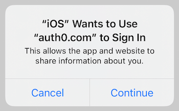

# Auth0.swift Beta

[](https://circleci.com/gh/auth0/Auth0.swift/tree/master)
[](https://codecov.io/github/auth0/Auth0.swift)


> ⚠️ This library is currently in **Beta** and has not had a complete security review. We do not recommend using this library in production yet. As we move towards general availability, please be aware that releases may contain breaking changes.

Swift SDK that lets you communicate efficiently with many of the [Auth0 API](https://auth0.com/docs/api) endpoints and enables you to seamlessly integrate the Auth0 login.

**Migrating from v1? Check our [Migration Guide](V2_MIGRATION_GUIDE.md).**

---

## Table of Contents

- [Documentation](#documentation)
- [Requirements](#requirements)
- [Installation](#installation)
  + [Swift Package Manager](#swift-package-manager)
  + [Cocoapods](#cocoapods)
  + [Carthage](#carthage)
- [Getting Started](#getting-started)
  + [Configuration](#configuration)
  + [Web Auth Configuration (iOS / macOS)](#web-auth-configuration-ios--macos)
  + [Web Auth Login (iOS / macOS)](#web-auth-login-ios--macos)
  + [Web Auth Logout (iOS / macOS)](#web-auth-logout-ios--macos)
  + [SSO Alert Box (iOS / macOS)](#sso-alert-box-ios--macos)
- [Next Steps](#next-steps)
  + [Common Tasks](#common-tasks)
  + [Web Auth Options (iOS / macOS)](#web-auth-options-ios--macos)
  + [Credentials Manager (iOS / macOS / tvOS / watchOS)](#credentials-manager-ios--macos--tvos--watchos)
  + [Authentication API (iOS / macOS / tvOS / watchOS)](#authentication-api-ios--macos--tvos--watchos)
  + [Management API (Users) (iOS / macOS / tvOS / watchOS)](#management-api-users-ios--macos--tvos--watchos)
  + [Logging](#logging)
- [Other Features](#other-features)
  + [Native Social Login](#native-social-login)
  + [Organizations](#organizations)
  + [Bot Detection](#bot-detection)
  + [Custom Domains](#custom-domains)
- [Support Policy](#support-policy)
- [Issue Reporting](#issue-reporting)
- [What is Auth0?](#what-is-auth0)
- [License](#license)

## Documentation

- [Quickstarts](https://auth0.com/docs/quickstart/native/ios-swift)
- [Sample app](https://github.com/auth0-samples/auth0-ios-swift-sample)
- [API Documentation](https://auth0.github.io/Auth0.swift/)
  + [Web Auth](https://auth0.github.io/Auth0.swift/Protocols/WebAuth.html)
  + [Credentials Manager](https://auth0.github.io/Auth0.swift/Structs/CredentialsManager.html)
  + [Authentication API Client](https://auth0.github.io/Auth0.swift/Protocols/Authentication.html)
  + [Management API Client (Users)](https://auth0.github.io/Auth0.swift/Protocols/Users.html)
- [FAQ](FAQ.md)

## Requirements

- iOS 12+ / macOS 10.15+ / tvOS 12.0+ / watchOS 6.2+
- Xcode 12.x / 13.x
- Swift 5.3+

> ⚠️ Check the [Support Policy](#support-policy) to learn when dropping Xcode, Swift, and platform versions will not be considered a **breaking change**.

## Installation

### Swift Package Manager

If you are using SPM, open the following menu item in Xcode:

**File > Add Packages...**

In the **Search or Enter Package URL** search box enter this URL: 

```text
https://github.com/auth0/Auth0.swift.git
```

Then select the **Exact Version** dependency rule, input `2.0.0-beta.0` as the version number, and press **Add Package**.

> For further reference on SPM, check [its official documentation](https://developer.apple.com/documentation/swift_packages/adding_package_dependencies_to_your_app).

### Cocoapods

If you are using [Cocoapods](https://cocoapods.org), add this line to your `Podfile`:

```ruby
pod 'Auth0', '2.0.0-beta.0'
```

Then run `pod install`.

> For more information on Cocoapods, check [their official documentation](https://guides.cocoapods.org/using/getting-started.html).

### Carthage

If you are using [Carthage](https://github.com/Carthage/Carthage), add the following line to your `Cartfile`:

```text
github "auth0/Auth0.swift" "2.0.0-beta.0"
```

Then run `carthage bootstrap --use-xcframeworks`.

> For more information about Carthage usage, check [their official documentation](https://github.com/Carthage/Carthage#if-youre-building-for-ios-tvos-or-watchos).

## Getting Started

### Configuration

Auth0.swift needs the **Client ID** and **Domain** of the Auth0 application to communicate with Auth0. These details can be found on the settings page of your [Auth0 application](https://manage.auth0.com/#/applications/). If you are using a [Custom Domain](https://auth0.com/docs/custom-domains), use the value of your Custom Domain instead of the value from the settings page.

> ⚠️ Make sure that the [application type](https://auth0.com/docs/configure/applications) of the Auth0 application is **Native**. If you don’t have a Native Auth0 application, [create one](https://auth0.com/docs/get-started/create-apps/native-apps) before continuing.

#### Configure Client ID and Domain with a plist

Create a `plist` file named `Auth0.plist` in your application bundle with the following content:

```xml
<?xml version="1.0" encoding="UTF-8"?>
<!DOCTYPE plist PUBLIC "-//Apple//DTD PLIST 1.0//EN" "http://www.apple.com/DTDs/PropertyList-1.0.dtd">
<plist version="1.0">
<dict>
  <key>ClientId</key>
  <string>YOUR_AUTH0_CLIENT_ID</string>
  <key>Domain</key>
  <string>YOUR_AUTH0_DOMAIN</string>
</dict>
</plist>
```

#### Configure Client ID and Domain programmatically

<details>
  <summary>For Web Auth</summary>

```swift
Auth0
    .webAuth(clientId: "YOUR_AUTH0_CLIENT_ID", domain: "YOUR_AUTH0_DOMAIN")
    // ...
```
</details>

<details>
  <summary>For the Authentication API client</summary>

```swift
Auth0
    .authentication(clientId: "YOUR_AUTH0_CLIENT_ID", domain: "YOUR_AUTH0_DOMAIN")
    // ...
```
</details>

<details>
  <summary>For the Management API client (Users)</summary>

```swift
Auth0
    .users(token: "ACCESS_TOKEN", domain: "YOUR_AUTH0_DOMAIN") // You only need the Domain
    // ...
```
</details>

### Web Auth Configuration (iOS / macOS)

For Web Auth, you need to set up the callback and logout URLs in the settings page of your Auth0 application.

#### Configure Callback URL

The callback URL is the URL that Auth0 invokes **after the authentication process** to redirect back to your application. Since callback URLs can be manipulated, you will need to add your callback URL to the **Allowed Callback URLs** field in the settings page of your Auth0 application. This will enable Auth0 to recognize these URLs as valid. If the callback URL is not set, the authentication will fail.

In your application's `Info.plist` file, register your iOS / macOS bundle identifier as a custom URL scheme.

```xml
<key>CFBundleURLTypes</key>
<array>
    <dict>
        <key>CFBundleTypeRole</key>
        <string>None</string>
        <key>CFBundleURLName</key>
        <string>auth0</string>
        <key>CFBundleURLSchemes</key>
        <array>
            <string>YOUR_BUNDLE_IDENTIFIER</string>
        </array>
    </dict>
</array>
```

> If your `Info.plist` is not shown in this format, you can **Right Click** on `Info.plist` in Xcode and then select **Open As > Source Code**.

Finally, go to the settings page of your [Auth0 application](https://manage.auth0.com/#/applications/) and add to the **Allowed Callback URLs** field the following entry:

```text
YOUR_BUNDLE_IDENTIFIER://YOUR_AUTH0_DOMAIN/ios/YOUR_BUNDLE_IDENTIFIER/callback
```

E.g. if your bundle identifier was `com.company.myapp` and your Auth0 domain was `company.us.auth0.com`, then this value would be:

```text
com.company.myapp://company.us.auth0.com/ios/com.company.myapp/callback
```

#### Configure Logout URL

The callback URL is the URL that Auth0 invokes **after removing the session cookie** to redirect back to your application. If the logout URL is not set, the logout will fail.

Go to the settings page of your [Auth0 application](https://manage.auth0.com/#/applications/) and copy the **Allowed Callback URLs** value you added for authentication into the **Allowed Logout URLs** field.

```text
YOUR_BUNDLE_IDENTIFIER://YOUR_AUTH0_DOMAIN/ios/YOUR_BUNDLE_IDENTIFIER/callback
```

### Web Auth Login (iOS / macOS)

1. Import the `Auth0` module in the file where you want to present the login page.

```swift
import Auth0
```

2. Present the [Universal Login](https://auth0.com/docs/login/universal-login) page in the action of your **Login** button.

```swift
Auth0
    .webAuth()
    .start { result in
        switch result {
        case .success(let credentials):
            print("Obtained credentials: \(credentials)")
        case .failure(let error):
            print("Failed with \(error)")
        }
    }
```

<details>
  <summary>Using Combine</summary>

```swift
Auth0
    .webAuth()
    .publisher()
    .sink(receiveCompletion: { completion in
        if case .failure(let error) = completion {
            print("Failed with \(error)")
        }
    }, receiveValue: { credentials in
        print("Obtained credentials: \(credentials)")
    })
    .store(in: &cancellables)
```
</details>

<details>
  <summary>Using async/await</summary>

```swift
do {
    let credentials = try await Auth0
        .webAuth()
        .start()
    print("Obtained credentials: \(credentials)")
} catch {
    print("Failed with \(error)")
}
```
</details>

### Web Auth Logout (iOS / macOS)

Logging the user out involves clearing the Universal Login session cookie and then deleting the user's credentials from your application. 

To clear the session cookie, call the `clearSession()` method in the action of your **Logout** button.

```swift
Auth0
    .webAuth()
    .clearSession { result in
        switch result {
        case .success:
            print("Logged out")
        case .failure(let error):
            print("Failed with \(error)")
        }
    }
```

<details>
  <summary>Using Combine</summary>

```swift
Auth0
    .webAuth()
    .clearSession()
    .sink(receiveCompletion: { completion in
        switch completion {
        case .finished:
            print("Logged out")
        case .failure(let error):
            print("Failed with \(error)")
        }
    }, receiveValue: {})
    .store(in: &cancellables)
```
</details>

<details>
  <summary>Using async/await</summary>

```swift
do {
    try await Auth0
        .webAuth()
        .clearSession()
    print("Logged out")
} catch {
    print("Failed with \(error)")
}
```
</details>

Once the session cookie has been cleared, delete the user's credentials from your application.

### SSO Alert Box (iOS / macOS)



Check the [FAQ](FAQ.md) for more information about the alert box that pops up **by default** when using Web Auth.

[Go up ⤴](#table-of-contents)

## Next Steps

### Common Tasks

#### Web Auth Signup (iOS / macOS)

You can make users land directly on the Signup page instead of the Login page by specifying the `"screen_hint": "signup"` parameter when performing Web Authentication. Note that this can be combined with `"prompt": "login"`, which indicates whether you want to always show the authentication page or you want to skip if there's an existing session.

| Parameters                                     | No existing session   | Existing session              |
|:-----------------------------------------------|:----------------------|:------------------------------|
| No extra parameters                            | Shows the login page  | Redirects to the callback url |
| `"screen_hint": "signup"`                      | Shows the signup page | Redirects to the callback url |
| `"prompt": "login"`                            | Shows the login page  | Shows the login page          |
| `"prompt": "login", "screen_hint": "signup"`   | Shows the signup page | Shows the signup page         |

```swift
Auth0
    .webAuth()
    .parameters(["screen_hint": "signup"])
    .start { result in
        switch result {
        case .success(let credentials):
            print("Obtained credentials: \(credentials)")
        case .failure(let error):
            print("Failed with \(error)")
        }
    }
```

> ⚠️ The `screen_hint` parameter can only be used with the **New Universal Login Experience**, not the **Classic Experience**.

<details>
  <summary>Using Combine</summary>

```swift
Auth0
    .webAuth()
    .parameters(["screen_hint": "signup"])
    .publisher()
    .sink(receiveCompletion: { completion in
        if case .failure(let error) = completion {
            print("Failed with \(error)")
        }
    }, receiveValue: { credentials in
        print("Obtained credentials: \(credentials)")
    })
    .store(in: &cancellables)
```
</details>

<details>
  <summary>Using async/await</summary>

```swift
do {
    let credentials = try await Auth0
        .webAuth()
        .parameters(["screen_hint": "signup"])
        .start()
    print("Obtained credentials: \(credentials)")
} catch {
    print("Failed with \(error)")
}
```
</details>

#### Renew credentials (iOS / macOS / tvOS / watchOS)

Use a [Refresh Token](https://auth0.com/docs/security/tokens/refresh-tokens) to renew the user's credentials. It's recommended that you read and understand the Refresh Token process beforehand.

> You need the `offline_access` [scope](https://auth0.com/docs/configure/apis/scopes) to get a Refresh Token from Auth0.

```swift
Auth0
    .authentication()
    .renew(withRefreshToken: refreshToken)
    .start { result in
        switch result {
        case .success(let credentials):
            print("Obtained new credentials: \(credentials)")
        case .failure(let error):
            print("Failed with \(error)")
        }
    }
```

<details>
  <summary>Using Combine</summary>

```swift
Auth0
    .authentication()
    .renew(withRefreshToken: refreshToken)
    .publisher()
    .sink(receiveCompletion: { completion in
        if case .failure(let error) = completion {
            print("Failed with \(error)")
        }
    }, receiveValue: { credentials in
        print("Obtained new credentials: \(credentials)")
    })
    .store(in: &cancellables)
```
</details>

<details>
  <summary>Using async/await</summary>

```swift
do {
    let credentials = try await Auth0
        .authentication()
        .renew(withRefreshToken: refreshToken)
        .start()
    print("Obtained new credentials: \(credentials)")
} catch {
    print("Failed with \(error)")
}
```
</details>

### Web Auth Options (iOS / macOS)

The following are some of the available Web Auth configuration options. Check the [API documentation](https://auth0.github.io/Auth0.swift/Protocols/WebAuth.html) for the complete list.

#### Use any Auth0 connection

Specify an Auth0 connection to directly show that Identity Provider's login page, skipping the Universal Login page itself. The connection must first be enabled for your Auth0 application in the [Dashboard](https://manage.auth0.com/#/applications/).

```swift
Auth0
    .webAuth()
    .connection("facebook") // Show the Facebook login page
    // ...
```

#### Add an audience value

Specify an audience to obtain an Access Token that can be used to make authenticated requests to a backend. The audience value is the **API Identifier** of your [Auth0 API](https://auth0.com/docs/configure/apis).

```swift
Auth0
    .webAuth()
    .audience("YOUR_API_IDENTIFIER")
    // ...
```

#### Add a scope value

Specify a [scope](https://auth0.com/docs/configure/apis/scopes) to request permission to access protected resources, like the user profile. The default scope value is `openid profile email`. Regardless of the scope value configured, `openid` is always included.

```swift
Auth0
    .webAuth()
    .scope("openid profile email offline_access read:todos")
    // ...
```

Use `connectionScope()` to configure a scope value for an Auth0 connection.

```swift
Auth0
    .webAuth()
    .connection("connection-name")
    .connectionScope("user_friends email")
    // ...
```

### Credentials Manager (iOS / macOS / tvOS / watchOS)

[API documentation ↗](https://auth0.github.io/Auth0.swift/Structs/CredentialsManager.html)

The Credentials Manager utility provides a convenience to securely store and retrieve the user's credentials from the Keychain.

```swift
let credentialsManager = CredentialsManager(authentication: Auth0.authentication())
```

#### Store Credentials

Store user credentials securely in the Keychain.

```swift
credentialsManager.store(credentials: credentials)
```

#### Retrieve stored credentials 

Credentials will automatically be renewed (if expired) using the [Refresh Token](https://auth0.com/docs/security/tokens/refresh-tokens). **This method is thread-safe.**

> You need the `offline_access` [scope](https://auth0.com/docs/configure/apis/scopes) to get a Refresh Token from Auth0.

```swift
credentialsManager.credentials { result in 
    switch result {
    case .success(let credentials):
        print("Obtained credentials: \(credentials)")
    case .failure(let error):
        print("Failed with \(error)") 
    }
}
```

<details>
  <summary>Using Combine</summary>

```swift
credentialsManager
    .credentials()
    .sink(receiveCompletion: { completion in
        if case .failure(let error) = completion {
            print("Failed with \(error)")
        }
    }, receiveValue: { credentials in
        print("Obtained credentials: \(credentials)")
    })
    .store(in: &cancellables)
```
</details>

<details>
  <summary>Using async/await</summary>

```swift
do {
    let credentials = try await credentialsManager.credentials()
    print("Obtained credentials: \(credentials)")
} catch {
    print("Failed with \(error)")
}
```
</details>

#### Clear credentials and revoke Refresh Tokens

Credentials can be cleared from the Keychain by using the `clear()` method.

```swift
let didClear = credentialsManager.clear()
```

In addition, credentials can be cleared and the Refresh Token revoked using a single call to `revoke()`. This method will attempt to revoke the current Refresh Token stored by the Credentials Manager and then clear credentials from the Keychain. If revoking the token results in an error, the credentials will not be cleared.

```swift
credentialsManager.revoke { result in
    switch result {
    case .success:
        print("Success")
    case .failure(let error):
        print("Failed with \(error)") 
    }
}
```

<details>
  <summary>Using Combine</summary>

```swift
credentialsManager
    .revoke()
    .sink(receiveCompletion: { completion in
        switch completion {
        case .finished:
            print("Success")
        case .failure(let error):
            print("Failed with \(error)")
        }
    }, receiveValue: {})
    .store(in: &cancellables)
```
</details>

<details>
  <summary>Using async/await</summary>

```swift
do {
    try await credentialsManager.revoke()
    print("Success")
} catch {
    print("Failed with \(error)")
}
```
</details>

#### Retrieve the stored user information

The stored [ID Token](https://auth0.com/docs/security/tokens/id-tokens) contains a copy of the user information at the time of authentication (or renewal, if the credentials were renewed). That user information can be retrieved from the Keychain synchronously, without checking if the credentials are expired.

```swift
let user = credentialsManager.user
```

> To get the latest user information, use the `userInfo(withAccessToken:)` method of the Authentication API client.

#### Biometric authentication

You can enable an additional level of user authentication before retrieving credentials using the biometric authentication supported by your device, e.g. Face ID or Touch ID.

```swift
credentialsManager.enableBiometrics(withTitle: "Touch to Login")
```

If needed, you can use a specific `LAPolicy` - e.g. you might want to support FaceID, but allow fallback to passcode.

```swift
credentialsManager.enableBiometrics(withTitle: "Touch or enter passcode to Login", 
                                    evaluationPolicy: .deviceOwnerAuthentication)
```

> ⚠️ Retrieving the user information with `credentialsManager.user` will not be protected by Biometric authentication.

### Authentication API (iOS / macOS / tvOS / watchOS)

[API documentation ↗](https://auth0.github.io/Auth0.swift/Protocols/Authentication.html)

The Authentication API exposes the AuthN/AuthZ functionality of Auth0, as well as the supported identity protocols like OpenID Connect, OAuth 2.0, and SAML.
We recommend using [Universal Login](https://auth0.com/docs/login/universal-login), but if you prefer to build your own UI you can use our API endpoints to do so. However, some Auth flows (grant types) are disabled by default so you must enable them via your [Auth0 Dashboard](https://manage.auth0.com/#/applications/), as explained in [Update Grant Types](https://auth0.com/docs/configure/applications/update-grant-types).

For login or signup with username/password, the `Password` Grant Type needs to be enabled in your application. If you set the grants via the Management API you should activate both `http://auth0.com/oauth/grant-type/password-realm` and `Password`, otherwise the Auth0 Dashboard will take care of activating both when `Password` is enabled.

#### Login with database connection

```swift
Auth0
    .authentication()
    .login(usernameOrEmail: "support@auth0.com",
           password: "secret-password",
           realmOrConnection: "Username-Password-Authentication",
           scope: "openid profile email offline_access")
    .start { result in
        switch result {
        case .success(let credentials):
            print("Obtained credentials: \(credentials)")
        case .failure(let error):
            print("Failed with \(error)")
        }
    }
```

<details>
  <summary>Using Combine</summary>

```swift
Auth0
    .authentication()
    .login(usernameOrEmail: "support@auth0.com",
           password: "secret-password",
           realmOrConnection: "Username-Password-Authentication",
           scope: "openid profile email offline_access")
    .publisher()
    .sink(receiveCompletion: { completion in
        if case .failure(let error) = completion {
            print("Failed with \(error)")
        }
    }, receiveValue: { credentials in
        print("Obtained credentials: \(credentials)")
    })
    .store(in: &cancellables)
```
</details>

<details>
  <summary>Using async/await</summary>

```swift
do {
    let credentials = try await Auth0
        .authentication()
        .login(usernameOrEmail: "support@auth0.com",
               password: "secret-password",
               realmOrConnection: "Username-Password-Authentication",
               scope: "openid profile email offline_access")
        .start()
    print("Obtained credentials: \(credentials)")
} catch {
    print("Failed with \(error)")
}
```
</details>

#### Sign up with database connection

```swift
Auth0
    .authentication()
    .signup(email: "support@auth0.com",
            password: "secret-password",
            connection: "Username-Password-Authentication",
            userMetadata: ["first_name": "First", "last_name": "Last"])
    .start { result in
        switch result {
        case .success(let user):
            print("User signed up: \(user)")
        case .failure(let error):
            print("Failed with \(error)")
        }
    }
```

<details>
  <summary>Using Combine</summary>

```swift
Auth0
    .authentication()
    .signup(email: "support@auth0.com",
            password: "secret-password",
            connection: "Username-Password-Authentication",
            userMetadata: ["first_name": "First", "last_name": "Last"])
    .publisher()
    .sink(receiveCompletion: { completion in
        if case .failure(let error) = completion {
            print("Failed with \(error)")
        }
    }, receiveValue: { user in
        print("User signed up: \(user)")
    })
    .store(in: &cancellables)
```
</details>

<details>
  <summary>Using async/await</summary>

```swift
do {
    let user = try await Auth0
        .authentication()
        .signup(email: "support@auth0.com",
                password: "secret-password",
                connection: "Username-Password-Authentication",
                userMetadata: ["first_name": "First", "last_name": "Last"])
        .start()
    print("User signed up: \(user)")
} catch {
    print("Failed with \(error)")
}
```
</details>

#### Passwordless login

Passwordless is a two-step authentication flow that requires the **Passwordless OTP** grant to be enabled for your Auth0 application. Check [our documentation](https://auth0.com/docs/configure/applications/application-grant-types) for more information and how to enable it.

##### 1. Start the passwordless flow
To start the flow, you request a code to be sent to the user's email or phone number. For email scenarios only, a link can be sent in place of the code.

With an email:

```swift
Auth0
    .authentication(clientId: clientId, domain: "samples.auth0.com")
    .startPasswordless(email: "support@auth0.com")
    .start { result in
        switch result {
        case .success:
            print("Code sent")
        case .failure(let error):
            print("Failed with \(error)")
        }
    }
```

<details>
  <summary>Using Combine</summary>

```swift
Auth0
    .authentication()
    .startPasswordless(email: "support@auth0.com")
    .publisher()
    .sink(receiveCompletion: { completion in
        switch completion {
        case .finished:
            print("Code sent")
        case .failure(let error):
            print("Failed with \(error)")
        }
    }, receiveValue: {})
    .store(in: &cancellables)
```
</details>

<details>
  <summary>Using async/await</summary>

```swift
do {
    try await Auth0
        .authentication()
        .startPasswordless(email: "support@auth0.com")
        .start()
    print("Code sent")
} catch {
    print("Failed with \(error)")
}
```
</details>

With a phone number:

```swift
Auth0
    .authentication(clientId: clientId, domain: "samples.auth0.com")
    .startPasswordless(phoneNumber: "+12025550135")
    .start { result in
        switch result {
        case .success:
            print("Code sent")
        case .failure(let error):
            print("Failed with \(error)")
        }
    }
```

<details>
  <summary>Using Combine</summary>

```swift
Auth0
    .authentication()
    .startPasswordless(phoneNumber: "+12025550135")
    .publisher()
    .sink(receiveCompletion: { completion in
        switch completion {
        case .finished:
            print("Code sent")
        case .failure(let error):
            print("Failed with \(error)")
        }
    }, receiveValue: {})
    .store(in: &cancellables)
```
</details>

<details>
  <summary>Using async/await</summary>

```swift
do {
    try await Auth0
        .authentication()
        .startPasswordless(phoneNumber: "+12025550135")
        .start()
    print("Code sent")
} catch {
    print("Failed with \(error)")
}
```
</details>

##### 2. Login with the received code
To complete the authentication, you must send back that received code along with the email or phone number used to start the flow.

With an email:

```swift
Auth0
    .authentication(clientId: clientId, domain: "samples.auth0.com")
    .login(email: "support@auth0.com", code: "123456")
    .start { result in
        switch result {
        case .success(let credentials):
            print("Obtained credentials: \(credentials)")
        case .failure(let error):
            print("Failed with \(error)")
        }
    }
```

<details>
  <summary>Using Combine</summary>

```swift
Auth0
    .authentication()
    .login(email: "support@auth0.com", code: "123456")
    .publisher()
    .sink(receiveCompletion: { completion in
        if case .failure(let error) = completion {
            print("Failed with \(error)")
        }
    }, receiveValue: { credentials in
        print("Obtained credentials: \(credentials)")
    })
    .store(in: &cancellables)
```
</details>

<details>
  <summary>Using async/await</summary>

```swift
do {
    let credentials = try await Auth0
        .authentication()
        .login(email: "support@auth0.com", code: "123456")
        .start()
    print("Obtained credentials: \(credentials)")
} catch {
    print("Failed with \(error)")
}
```
</details>

With a phone number:

```swift
Auth0
    .authentication(clientId: clientId, domain: "samples.auth0.com")
    .login(phoneNumber: "+12025550135", code: "123456")
    .start { result in
        switch result {
        case .success(let credentials):
            print("Obtained credentials: \(credentials)")
        case .failure(let error):
            print("Failed with \(error)")
        }
    }
```

<details>
  <summary>Using Combine</summary>

```swift
Auth0
    .authentication()
    .login(phoneNumber: "+12025550135", code: "123456")
    .publisher()
    .sink(receiveCompletion: { completion in
        if case .failure(let error) = completion {
            print("Failed with \(error)")
        }
    }, receiveValue: { credentials in
        print("Obtained credentials: \(credentials)")
    })
    .store(in: &cancellables)
```
</details>

<details>
  <summary>Using async/await</summary>

```swift
do {
    let credentials = try await Auth0
        .authentication()
        .login(phoneNumber: "+12025550135", code: "123456")
        .start()
    print("Obtained credentials: \(credentials)")
} catch {
    print("Failed with \(error)")
}
```
</details>

#### Configuration

##### Add custom parameters

Use the `parameters()` method to add custom parameters to any request.

```swift
Auth0
    .authentication()
    .renew(withRefreshToken: refreshToken) // Any request
    .parameters(["key": "value"])
    // ...
```

##### Add custom headers

Use the `headers()` method to add custom headers to any request.

```swift
Auth0
    .authentication()
    .renew(withRefreshToken: refreshToken) // Any request
    .headers(["key": "value"])
    // ...
```

### Management API (Users) (iOS / macOS / tvOS / watchOS)

[API documentation ↗](https://auth0.github.io/Auth0.swift/Protocols/Users.html)

You can request more information about a user's profile and manage the user's metadata by accessing the Auth0 [Management API](https://auth0.com/docs/api/management/v2). For security reasons native mobile applications are restricted to a subset of the Management API functionality.

You can find a detailed guide in this [Quickstart](https://auth0.com/docs/quickstart/native/ios-swift/03-user-sessions#managing-metadata).

#### Retrieve user metadata

```swift
Auth0
    .users(token: accessToken)
    .get(userId, fields: ["user_metadata"])
    .start { result in
        switch result {
        case .success(let user):
            print("User with metadata: \(user)")
        case .failure(let error):
            print("Failed with \(error)")
        }
    }
```

<details>
  <summary>Using Combine</summary>

```swift
Auth0
    .users(token: accessToken)
    .get(userId, fields: ["user_metadata"])
    .publisher()
    .sink(receiveCompletion: { completion in
        if case .failure(let error) = completion {
            print("Failed with \(error)")
        }
    }, receiveValue: { user in
        print("User with metadata: \(user)")
    })
    .store(in: &cancellables)
```
</details>

<details>
  <summary>Using async/await</summary>

```swift
do {
    let user = try await Auth0
        .users(token: accessToken)
        .get(userId, fields: ["user_metadata"])
        .start()
    print("User with metadata: \(user)") 
} catch {
    print("Failed with \(error)")
}
```
</details>

#### Update user metadata

```swift
Auth0
    .users(token: accessToken)
    .patch(userId, userMetadata: ["key": "value"])
    .start { result in
        switch result {
        case .success(let user):
            print("Updated user: \(user)")
        case .failure(let error):
            print("Failed with \(error)")
        }
    }
```

<details>
  <summary>Using Combine</summary>

```swift
Auth0
    .users(token: accessToken)
    .patch(userId, userMetadata: ["key": "value"])
    .publisher()
    .sink(receiveCompletion: { completion in
        if case .failure(let error) = completion {
            print("Failed with \(error)")
        }
    }, receiveValue: { user in
        print("Updated user: \(user)") 
    })
    .store(in: &cancellables)
```
</details>

<details>
  <summary>Using async/await</summary>

```swift
do {
    let user = try await Auth0
        .users(token: accessToken)
        .patch(userId, userMetadata: ["key": "value"])
        .start()
    print("Updated user: \(user)") 
} catch {
    print("Failed with \(error)")
}
```
</details>

#### Link an account

```swift
Auth0
    .users(token: idToken)
    .link("user identifier", withOtherUserToken: "another user token")
    .start { result in
        switch result {
        case .success:
            print("Accounts linked")
        case .failure(let error):
            print("Failed with \(error)")
        }
    }
```

<details>
  <summary>Using Combine</summary>

```swift
Auth0
    .users(token: idToken)
    .link("user identifier", withOtherUserToken: "another user token")
    .publisher()
    .sink(receiveCompletion: { completion in
        switch completion {
        case .finished:
            print("Accounts linked")
        case .failure(let error):
            print("Failed with \(error)")
        }
    }, receiveValue: { _ in })
    .store(in: &cancellables)
```
</details>

<details>
  <summary>Using async/await</summary>

```swift
do {
    _ = try await Auth0
        .users(token: idToken)
        .link("user identifier", withOtherUserToken: "another user token")
        .start()
    print("Accounts linked")
} catch {
    print("Failed with \(error)")
}
```
</details>

#### Configuration

##### Add custom parameters

Use the `parameters()` method to add custom parameters to any request.

```swift
Auth0
    .users(token: accessToken)
    .patch(userId, userMetadata: userMetadata) // Any request
    .parameters(["key": "value"])
    // ...
```

##### Add custom headers

Use the `headers()` method to add custom headers to any request.

```swift
Auth0
    .users(token: accessToken)
    .patch(userId, userMetadata: userMetadata) // Any request
    .headers(["key": "value"])
    // ...
```

### Logging

To enable Auth0.swift to log HTTP requests and the OAuth2 flow for debugging you can call the following method in either `WebAuth`, `Authentication` or `Users`:

```swift
Auth0
    .authentication()
    .logging(enabled: true)
    // ...
```

Then with a successful authentication you'll see something similar to the following:

```text
Safari: https://samples.auth0.com/authorize?.....
URL: com.auth0.myapp://samples.auth0.com/ios/com.auth0.MyApp/callback?...
POST https://samples.auth0.com/oauth/token HTTP/1.1
Content-Type: application/json

{"code":"...","client_id":"...","grant_type":"authorization_code","redirect_uri":"com.auth0.MyApp:\/\/samples.auth0.com\/ios\/com.auth0.MyApp\/callback","code_verifier":"..."}

HTTP/1.1 200
Pragma: no-cache
Content-Type: application/json
Strict-Transport-Security: max-age=3600
Date: Thu, 09 Jun 2016 19:04:39 GMT
Content-Length: 57
Cache-Control: no-cache
Connection: keep-alive

{"access_token":"...","token_type":"Bearer"}
```

> ⚠️ Set this flag only when **DEBUGGING** to avoid leaking user's credentials in the device log.

[Go up ⤴](#table-of-contents)

## Other Features

### Native Social Login

#### Sign in With Apple

If you've added [the Sign In with Apple flow](https://developer.apple.com/documentation/authenticationservices/implementing_user_authentication_with_sign_in_with_apple) to your app, after a successful Sign in With Apple authentication you can use the value of the `authorizationCode` property to perform a code exchange for Auth0 credentials.

```swift
Auth0
    .authentication()
    .login(appleAuthorizationCode: authCode)
    .start { result in
        switch result {
        case .success(let credentials):
            print("Obtained credentials: \(credentials)")
        case .failure(let error):
            print("Failed with \(error)")
        }
    }
```

<details>
  <summary>Using Combine</summary>

```swift
Auth0
    .authentication()
    .login(appleAuthorizationCode: authCode)
    .publisher()
    .sink(receiveCompletion: { completion in
        if case .failure(let error) = completion {
            print("Failed with \(error)")
        }
    }, receiveValue: { credentials in
        print("Obtained credentials: \(credentials)")
    })
    .store(in: &cancellables)
```
</details>

<details>
  <summary>Using async/await</summary>

```swift
do {
    let credentials = try await Auth0
        .authentication()
        .login(appleAuthorizationCode: authCode)
        .start()
    print("Obtained credentials: \(credentials)")
} catch {
    print("Failed with \(error)")
}
```
</details>

Find out more about [Setting up Sign in with Apple](https://auth0.com/docs/connections/social/apple-native) with Auth0.

#### Facebook Login

If you've added [the Facebook Login flow](https://developers.facebook.com/docs/facebook-login/ios) to your app, after a successful Faceboook authentication you can request a Session Access Token and the Facebook user profile, and use them both to perform a code exchange for Auth0 credentials.

```swift
Auth0
    .authentication()
    .login(facebookSessionAccessToken: sessionAccessToken, profile: profile)
    .start { result in
        switch result {
        case .success(let credentials):
            print("Obtained credentials: \(credentials)")
        case .failure(let error):
            print("Failed with \(error)")
        }
    }
```

<details>
  <summary>Using Combine</summary>

```swift
Auth0
    .authentication()
    .login(facebookSessionAccessToken: sessionAccessToken, profile: profile)
    .publisher()
    .sink(receiveCompletion: { completion in
        if case .failure(let error) = completion {
            print("Failed with \(error)")
        }
    }, receiveValue: { credentials in
        print("Obtained credentials: \(credentials)")
    })
    .store(in: &cancellables)
```
</details>

<details>
  <summary>Using async/await</summary>

```swift
do {
    let credentials = try await Auth0
        .authentication()
        .login(facebookSessionAccessToken: sessionAccessToken, profile: profile)
        .start()
    print("Obtained credentials: \(credentials)")
} catch {
    print("Failed with \(error)")
}
```
</details>

Find out more about [Setting up Facebook Login](https://auth0.com/docs/connections/social/facebook-native) with Auth0.

### Organizations

[Organizations](https://auth0.com/docs/organizations) is a set of features that provide better support for developers who build and maintain SaaS and Business-to-Business (B2B) applications. 

Using Organizations, you can:

- Represent teams, business customers, partner companies, or any logical grouping of users that should have different ways of accessing your applications, as organizations.
- Manage their membership in a variety of ways, including user invitation.
- Configure branded, federated login flows for each organization.
- Implement role-based access control, such that users can have different roles when authenticating in the context of different organizations.
- Build administration capabilities into your products, using Organizations APIs, so that those businesses can manage their own organizations.

Note that Organizations is currently only available to customers on our Enterprise and Startup subscription plans.

#### Log in to an organization

```swift
Auth0.webAuth()
    .organization(organizationId)
    .start { result in
        switch result {
        case .success(let credentials):
            print("Obtained credentials: \(credentials)")
        case .failure(let error):
            print("Failed with \(error)")
        }
    }
```

<details>
  <summary>Using Combine</summary>

```swift
Auth0
    .webAuth()
    .organization(organizationId)
    .publisher()
    .sink(receiveCompletion: { completion in
        if case .failure(let error) = completion {
            print("Failed with \(error)")
        }
    }, receiveValue: { credentials in
        print("Obtained credentials: \(credentials)")
    })
    .store(in: &cancellables)
```
</details>

<details>
  <summary>Using async/await</summary>

```swift
do {
    let credentials = try await Auth0
        .webAuth()
        .organization(organizationId)
        .start()
    print("Obtained credentials: \(credentials)")
} catch {
    print("Failed with \(error)")
}
```
</details>

#### Accept user invitations

To accept organization invitations your app needs to support [Universal Links](https://developer.apple.com/documentation/xcode/allowing_apps_and_websites_to_link_to_your_content/supporting_universal_links_in_your_app). Tapping on the invitation link should open your app (invitations links are `https` only).

When your app gets opened by an invitation link, grab the invitation URL and pass it to `.invitationURL()`:

```swift
guard let url = URLContexts.first?.url else { return }

// You need to wait for the app to enter the foreground before launching Web Auth
NotificationCenter
    .default
    .publisher(for: UIApplication.didBecomeActiveNotification)
    .subscribe(on: DispatchQueue.main)
    .prefix(1)
    .sink { _ in
        Auth0
            .webAuth()
            .invitationURL(url)
            .start { result in
                switch result {
                case .success(let credentials):
                    print("Obtained credentials: \(credentials)")
                case .failure(let error):
                    print("Failed with \(error)")
                }
            }
    }
    .store(in: &cancellables)
```

### Bot Detection

If you are using the [Bot Detection](https://auth0.com/docs/configure/attack-protection/bot-detection) feature and performing database login/signup via the Authentication API, you need to handle the `isVerificationRequired` error. It indicates that the request was flagged as suspicious and an additional verification step is necessary to log the user in. That verification step is web-based, so you need to use Web Auth to complete it.

```swift
Auth0
    .authentication()
    .login(usernameOrEmail: email, 
           password: password, 
           realmOrConnection: connection, 
           scope: scope)
    .start { result in
        switch result {
        case .success(let credentials): // ...
        case .failure(let error) where error.isVerificationRequired:
            DispatchQueue.main.async {
                Auth0
                    .webAuth()
                    .connection(connection)
                    .scope(scope)
                    .useEphemeralSession()
                    // ☝🏼 Otherwise a session cookie will remain
                    .parameters(["login_hint": email])
                    // ☝🏼 So the user doesn't have to type it again
                    .start { result in
                        // ...
                    }
            }
        case .failure(let error): // ...
        }
    }
```

In the case of signup, you can add [an additional parameter](#signup-with-universal-login-ios--macos) to make the user land directly on the signup page.

```swift
Auth0
    .webAuth()
    .parameters(["login_hint": email, "screen_hint": "signup"])
    // ...
```

Check how to set up Web Auth in the [Web Auth Configuratikon](#web-auth-configuration-ios--macos) section.

### Custom Domains

Users of Auth0 Private Cloud with Custom Domains still on the [legacy behavior](https://auth0.com/docs/deploy/private-cloud/private-cloud-migrations/migrate-private-cloud-custom-domains) need to specify a custom issuer to match the Auth0 domain before performing Web Auth login. Otherwise, the ID Token validation will fail.

```swift
Auth0
    .webAuth()
    .issuer("https://YOUR_AUTH0_DOMAIN/")
    // ...
```

## Support Policy

This Policy defines the extent of the support for Xcode, Swift, and platform (iOS, macOS, tvOS, and watchOS) versions in Auth0.swift.

### Xcode

The only supported versions of Xcode are those that can be currently used to submit apps to the App Store. Dropping older, unsupported Xcode versions **will not be considered a breaking change**, and will be done in **minor** releases.

### Swift

The minimum supported Swift 5 minor version is the one released with the oldest-supported Xcode version. Dropping older, unsupported Swift 5 minors **will not be considered a breaking change**, and will be done in **minor** releases.

### Platforms

Only the last 4 major platform versions are supported, starting from:

- iOS **12**
- macOS **10.15**
- Catalyst **13**
- tvOS **12**
- watchOS **6.2**

Dropping older, unsupported platform versions **will not be considered a breaking change**, and will be done in **minor** releases.

> E.g. iOS 12 will cease to be supported when iOS 16 gets released, and Auth0.swift will be able to drop it in a minor release.

In the case of macOS, the yearly named releases are considered a major platform version for the purposes of this Policy, regardless of the actual version numbers.

## Issue Reporting

For general support or usage questions, use the [Auth0 Community](https://community.auth0.com/tags/c/sdks/5/swift) forums or raise a [support ticket](https://support.auth0.com/). Only [raise an issue](https://github.com/auth0/Auth0.swift/issues) if you have found a bug or want to request a feature.

**Do not report security vulnerabilities on the public GitHub issue tracker.** The [Responsible Disclosure Program](https://auth0.com/responsible-disclosure-policy) details the procedure for disclosing security issues.

## What is Auth0?

Auth0 helps you to:

* Add authentication with [multiple sources](https://auth0.com/docs/connections), either social identity providers such as **Google, Facebook, Microsoft Account, LinkedIn, GitHub, Twitter, Box, Salesforce** (amongst others), or enterprise identity systems like **Windows Azure AD, Google Apps, Active Directory, ADFS, or any SAML Identity Provider**.
* Add authentication through more traditional **[username/password databases](https://auth0.com/docs/connections/database/custom-db)**.
* Add support for **[linking different user accounts](https://auth0.com/docs/users/user-account-linking)** with the same user.
* Support for generating signed [JSON Web Tokens](https://auth0.com/docs/security/tokens/json-web-tokens) to call your APIs and **flow the user identity** securely.
* Analytics of how, when, and where users are logging in.
* Pull data from other sources and add it to the user profile through [JavaScript actions](https://auth0.com/docs/actions).

**Why Auth0?** Because you should save time, be happy, and focus on what really matters: building your product.

## License

This project is licensed under the MIT license. See the [LICENSE](LICENSE) file for more info.

---

[Go up ⤴](#table-of-contents)
